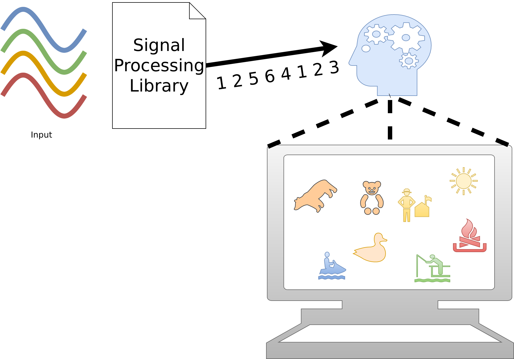

<section id="themes">
	<h2>Themes</h2>
		

			Set your presentation theme:  
			<!-- Hacks to swap themes after the page has loaded. Not flexible and only intended for the reveal.js demo deck. -->
                        <a href="#" onclick="document.getElementById('theme').setAttribute('href','css/theme/black.css'); return false;">Black (default)</a> -
			<a href="#" onclick="document.getElementById('theme').setAttribute('href','css/theme/white.css'); return false;">White</a> -
			<a href="#" onclick="document.getElementById('theme').setAttribute('href','css/theme/league.css'); return false;">League</a> -
			<a href="#" onclick="document.getElementById('theme').setAttribute('href','css/theme/sky.css'); return false;">Sky</a> -
			<a href="#" onclick="document.getElementById('theme').setAttribute('href','css/theme/beige.css'); return false;">Beige</a> -
			<a href="#" onclick="document.getElementById('theme').setAttribute('href','css/theme/simple.css'); return false;">Simple</a>  
			<a href="#" onclick="document.getElementById('theme').setAttribute('href','css/theme/serif.css'); return false;">Serif</a> -
			<a href="#" onclick="document.getElementById('theme').setAttribute('href','css/theme/blood.css'); return false;">Blood</a> -
			<a href="#" onclick="document.getElementById('theme').setAttribute('href','css/theme/night.css'); return false;">Night</a> -
			<a href="#" onclick="document.getElementById('theme').setAttribute('href','css/theme/moon.css'); return false;">Moon</a> -
			<a href="#" onclick="document.getElementById('theme').setAttribute('href','css/theme/solarized.css'); return false;">Solarized</a>
		

</section>

H:

# FC-Synes

## Synesthesia - Music Agent

Felipe Villareal Daza

Ciro Iván García López

H:

## Index

 1. Goal<!-- .element: class="fragment" data-fragment-index="1"-->
 2. Design<!-- .element: class="fragment" data-fragment-index="2"-->
 3. Interaction<!-- .element: class="fragment" data-fragment-index="3"-->
 4. Demo<!-- .element: class="fragment" data-fragment-index="4"-->
 5. Conclusions<!-- .element: class="fragment" data-fragment-index="5"-->
 6. Questions<!-- .element: class="fragment" data-fragment-index="6"-->

H:

<figure>
    
</figure>

H:

## Goal

* Build an agent that manipulates the scene by music.
* Music visualization

H:

## Design

* The following is the architecture of the project.
<figure>
    
</figure>
H:

## Demo

Run the demo

H:

## Conclusions
### Results

* A first approach to the proscene architecture.
* A custom agent that manage the events.
* An external library for the signal processing.

V: 

## Future Work
### Current limitations

* The number of events.
* The rate of notes in music is high. 

V:

## Future Work
### Next (possible) steps

* Extend the library to another type of inputs.
* Extend the events to sharp notes.
* Extract more information of the signal. 

H:

## Any question?

H:

## References

* [Math primer for graphics and game development](https://tfetimes.com/wp-content/uploads/2015/04/F.Dunn-I.Parberry-3D-Math-Primer-for-Graphics-and-Game-Development.pdf)
* [Imagenes taken from wikicommons](https://commons.wikimedia.org/wiki/Main_Page)
